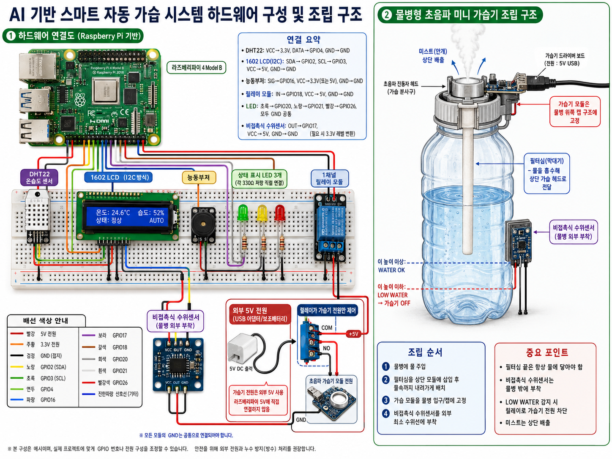

# AI 기반 실내 습도 예측 스마트 자동 가습 시스템 최종 기획서

## 1. 프로젝트명

**라즈베리파이를 활용한 AI 기반 실내 습도 예측 스마트 자동 가습 시스템 구현**

영문 제목:

**Development of an AI-based Indoor Humidity Prediction Smart Humidifier System Using Raspberry Pi**

GitHub 폴더명:

```text
10-ai-smart-humidifier
```

유튜브 제목:

```text
[10] 라즈베리파이5 AI 기반 스마트 자동 가습 시스템 | DHT22 + 수위센서 + LCD1602 + OpenWeatherMap API
```

## 2. 프로젝트 한 줄 요약

실내 온습도 센서와 외부 날씨 API 데이터를 기반으로 AI 모델이 10분 후 실내 습도를 예측하고, 예측값과 비접촉식 수위센서의 물 부족 감지 결과를 이용하여 물병형 초음파 미니 가습기를 자동 제어하는 AIoT 스마트 가습 시스템이다.

## 3. 프로젝트 목적

본 프로젝트의 목적은 단순히 현재 습도만 보고 가습기를 켜고 끄는 자동 가습기에서 벗어나, 센서 데이터, 외부 API 데이터, AI 예측 모델, 하드웨어 제어, LCD 출력, 웹 대시보드를 통합한 AIoT 시스템을 구현하는 것이다.

일반적인 자동 가습기는 다음과 같이 동작한다.

```text
현재 습도 < 기준값 -> 가습기 ON
현재 습도 >= 기준값 -> 가습기 OFF
```

하지만 이 방식은 너무 단순하다. 현재 습도만 보기 때문에 다음과 같은 상황을 제대로 반영하지 못한다.

- 외부 습도가 매우 낮아 실내 습도가 곧 떨어질 가능성
- 최근 5분 동안 실내 습도가 계속 감소 중인 상황
- 가습기가 켜져 있지만 물이 부족한 상황
- 현재 습도는 적정하지만 곧 건조해질 가능성

따라서 본 프로젝트에서는 현재 습도만 기준으로 하지 않고, AI 모델이 10분 후 실내 습도를 예측하게 한다. 시스템은 이 예측값을 기준으로 가습기를 제어한다.

```text
현재 습도 기준 제어 X
AI 예측 습도 기준 제어 O
```

## 4. 수업 내용과의 연결성

기말 프로젝트 조건은 다음과 같다.

1. 지난 수업 시간에 배운 내용 중 2개 이상 활용
2. 브레드보드와 센서 활용
3. 결과보고서 + 유튜브/깃허브 링크 + 소스코드 제출

본 프로젝트는 이 조건을 충분히 만족한다.

| 수업 요소 | 본 프로젝트 적용 |
|---|---|
| GPIO 제어 | LED, 부저, 릴레이 제어 |
| 센서 활용 | DHT11/DHT22 온습도 센서, 비접촉식 수위센서 |
| 브레드보드 회로 | 센서, LED, 부저, 릴레이 연결 |
| Flask 웹서버 | 현재 상태 웹 대시보드 구현 |
| OpenWeatherMap API | 외부 온도·습도 데이터 수집 |
| AI 모델 탑재 | RandomForestRegressor 모델을 라즈베리파이에 탑재 |
| UI 설계 | 1602 LCD + Flask 대시보드 |
| 하드웨어 제어 | 릴레이로 가습기 전원 ON/OFF |
| 안전 제어 | 물 부족 시 가습기 강제 정지 |

수업 자료에서는 OpenWeatherMap API를 이용해 외부 날씨 데이터를 가져오고 JSON 데이터에서 온도와 습도를 추출하는 실습을 다룬다. 본 프로젝트에서는 이 API 데이터를 단순 표시용이 아니라 AI 예측 모델의 입력값으로 활용한다.

또한 마지막 수업에서 다룬 “학습된 AI 모델을 저장하고 예측에 사용하는 개념”을 센서 데이터 기반 습도 예측 모델에 적용한다.

## 5. 최종 시스템 컨셉

전체 시스템은 다음 흐름으로 동작한다.

1. DHT 센서가 실내 온도와 습도를 측정한다.
2. OpenWeatherMap API가 외부 온도와 외부 습도를 가져온다.
3. 비접촉식 수위센서가 물병 내부의 물 부족 여부를 외부에서 감지한다.
4. 최근 5분 동안 실내 습도가 얼마나 변했는지 계산한다.
5. AI 모델이 현재 데이터를 입력받아 10분 후 실내 습도를 예측한다.
6. 물이 부족하면 AI 예측값과 관계없이 가습기를 강제로 끈다.
7. 물이 충분하면 AI 예측 습도를 기준으로 가습기를 ON/OFF 한다.
8. LCD에 현재 습도, AI 예측 습도, 가습기 상태를 표시한다.
9. LED와 부저로 상태를 표시한다.
10. Flask 웹 대시보드에 전체 상태를 표시한다.

## 6. 기존 자동 가습기와 차별점

### 6-1. 일반 자동 가습기

```text
현재 습도 45% 미만 -> 가습기 ON
현재 습도 60% 이상 -> 가습기 OFF
```

이 방식은 단순 조건문이다. AI라고 보기 어렵다.

### 6-2. 본 프로젝트

```text
실내 온도
실내 습도
외부 온도
외부 습도
최근 습도 변화량
가습기 현재 상태
물 수위 상태
        ↓
AI 모델 입력
        ↓
10분 후 실내 습도 예측
        ↓
예측값 기준으로 가습기 제어
```

예를 들어 현재 습도가 52%라면 일반 조건문 방식에서는 가습기를 켜지 않는다. 하지만 외부 습도가 낮고 최근 습도가 빠르게 떨어지는 중이라면 AI 모델은 10분 후 습도를 43%로 예측할 수 있다. 이 경우 시스템은 미리 가습기를 켠다.

반대로 현재 습도가 44%로 낮더라도, 외부 습도가 높고 실내 습도가 상승 중이라면 AI가 10분 후 습도를 48%로 예측할 수 있다. 이 경우 가습기를 켜지 않거나 짧게만 작동시킨다.

이 차이가 본 프로젝트의 핵심이다.

## 7. AI 기능 설계

### 7-1. AI가 하는 일

이 프로젝트에서 AI는 가습기를 직접 켜고 끄는 단순 명령을 내리는 것이 아니라, **10분 후 실내 습도를 예측하는 역할**을 한다.

이후 제어 로직은 AI가 예측한 값을 기준으로 가습기 ON/OFF를 결정한다.

### 7-2. AI 모델 종류

최종 추천 모델:

- RandomForestRegressor

선택 이유:

1. 여러 입력값의 비선형 관계를 반영할 수 있음
2. 딥러닝보다 구현이 쉽고 라즈베리파이에서 부담이 적음
3. 예측 성능이 안정적임
4. Feature Importance 분석이 가능함
5. 보고서에서 설명하기 쉬움

대체 가능 모델:

- DecisionTreeRegressor
- LinearRegression

최종 구현은 RandomForestRegressor를 기준으로 한다.

### 7-3. AI 입력값

| 입력값 | 설명 |
|---|---|
| indoor_temp | 현재 실내 온도 |
| indoor_humidity | 현재 실내 습도 |
| outdoor_temp | 외부 온도 |
| outdoor_humidity | 외부 습도 |
| humidity_change_5min | 최근 5분간 실내 습도 변화량 |
| humidifier_state | 현재 가습기 상태, ON=1/OFF=0 |
| water_state | 물 상태, 물 있음=1/물 부족=0 |

### 7-4. AI 출력값

| 출력값 | 설명 |
|---|---|
| predicted_humidity_10min | AI가 예측한 10분 후 실내 습도 |

### 7-5. AI 모델 학습 구조

소스코드는 다음처럼 분리한다.

```text
train_model.py
-> 학습용 데이터 CSV 불러오기
-> RandomForestRegressor 학습
-> 모델 평가
-> humidity_predictor.pkl 저장

main.py
-> humidity_predictor.pkl 불러오기
-> 실시간 센서값/API값 입력
-> 10분 후 습도 예측
-> 예측값 기준으로 가습기 제어
```

이렇게 분리해야 “AI 모델을 학습하고 라즈베리파이에 탑재했다”는 설명이 명확해진다.

### 7-6. AI 모델 파일

학습된 모델은 다음 경로에 저장한다.

```text
model/humidity_predictor.pkl
```

이 파일은 수업에서 다룬 AI 모델의 “학습된 결과” 개념과 연결된다. 본 프로젝트에서는 학습 결과물을 `.pkl` 파일로 저장해 라즈베리파이에서 불러온다.

### 7-7. 모델 검증 계획

AI가 허술해 보이지 않게 하기 위해 모델 검증 결과를 보고서와 README에 포함한다.

평가 지표:

- MAE, Mean Absolute Error

설명:

MAE는 예측 습도와 실제 습도의 평균 오차를 의미한다. 예를 들어 MAE가 2.1이면, AI 모델의 예측 습도가 실제 습도와 평균 약 2.1%p 차이난다는 뜻이다.

보고서 예시 문장:

> 학습된 RandomForestRegressor 모델의 예측 성능을 확인하기 위해 MAE를 사용하였다. 예측 습도와 실제 습도의 평균 오차를 계산하여 모델이 실내 습도 변화를 어느 정도 정확하게 예측하는지 평가하였다.

### 7-8. Feature Importance 분석

RandomForestRegressor는 어떤 입력값이 예측에 많이 영향을 주었는지 확인할 수 있다.

예상 중요도:

1. indoor_humidity
2. humidity_change_5min
3. outdoor_humidity
4. humidifier_state
5. indoor_temp
6. outdoor_temp
7. water_state

보고서/README 예시 문장:

> Feature Importance 분석 결과, 현재 실내 습도와 최근 5분간 습도 변화량이 10분 후 습도 예측에 가장 큰 영향을 주는 것으로 나타났다. 외부 습도 또한 실내 습도 변화 예측에 영향을 주었으며, 이를 통해 외부 날씨 API 데이터를 AI 모델 입력값으로 사용하는 것이 의미 있음을 확인하였다.

## 8. API 활용 설계

### 8-1. 사용 API

- OpenWeatherMap API

### 8-2. 가져올 데이터

| 데이터 | 활용 |
|---|---|
| 외부 온도 | AI 모델 입력값 |
| 외부 습도 | 실내 습도 변화 예측 보조 |
| 날씨 상태 | Clear, Rain, Clouds 등 참고 |
| 측정 지역 | 기본값: Seoul |

수업 자료에서도 OpenWeatherMap API를 통해 JSON 형태로 날씨 데이터를 받아오고, `main.temp`, `main.humidity` 값을 추출하는 흐름을 다루고 있다. 본 프로젝트에서는 이 데이터를 AI 예측 모델의 입력값으로 사용한다.

### 8-3. API 사용 이유

외부 습도는 실내 습도 변화에 영향을 줄 수 있다.

```text
외부 습도 낮음 + 실내 습도 감소 중
-> 10분 후 실내 습도 하락 가능성 증가

외부 습도 높음 + 실내 습도 유지 중
-> 10분 후 실내 습도 유지 또는 상승 가능성
```

따라서 외부 날씨 API 데이터는 단순 장식용이 아니라, AI 모델의 예측 정확도를 높이기 위한 보조 입력값으로 사용된다.

## 9. 하드웨어 구성

### 9-1. 최종 부품 목록

| 부품 | 역할 |
|---|---|
| Raspberry Pi 4B 또는 5 | 전체 시스템 제어 |
| DHT11 또는 DHT22 | 실내 온도·습도 측정 |
| 비접촉식 수위센서 | 물병 외부에서 물 부족 감지 |
| 초음파 미니 가습기 모듈 | 실제 미스트 발생 |
| 물병 | 가습기 물 저장 |
| 필터심/막대기 | 물을 흡수해 상단 가습 헤드로 전달 |
| 1채널 릴레이 모듈 | 가습기 전원 ON/OFF 제어 |
| 1602 LCD | 현재 습도, 예측 습도, 상태 표시 |
| LED 3개 | 정상/가습/물부족 상태 표시 |
| 330Ω 저항 3개 | LED 보호 |
| 능동부저 | 물 부족 경고음 |
| 브레드보드 | 회로 구성 |
| 점퍼 케이블 | 부품 연결 |
| 외부 5V USB 전원 | 가습기 모듈 전원 공급 |

### 9-2. 하드웨어 구성 이미지



### 9-3. 추가 구매 목록

필수 구매:

1. 초음파 미니 가습기 모듈
2. 비접촉식 수위센서

선택 구매:

1. DHT22 온습도 센서
2. 로직 레벨 컨버터 또는 전압 분배용 저항

DHT11로도 가능하지만, DHT22를 사용하면 습도 측정 정확도가 더 좋아서 최종 결과물과 보고서 품질이 올라간다.

## 10. 물병형 가습기 조립 구조

초음파 미니 가습기 모듈은 물병 아래에 넣는 구조가 아니라, 물병 위쪽 캡 부분에 고정되는 구조다.

### 10-1. 실제 물리 구조

상단:

- 초음파 가습기 모듈
- 진동자 헤드
- 드라이버 보드
- USB 전원

중앙:

- 필터심 또는 막대기

하단:

- 물병 내부의 물

동작 원리:

```text
물병 안의 물
        ↓
필터심이 물을 흡수
        ↓
물이 상단 초음파 진동자 헤드로 전달
        ↓
초음파 진동자가 미스트 생성
        ↓
미스트가 위쪽으로 배출
```

필터심 끝은 반드시 물에 닿아 있어야 한다.

### 10-2. 조립 순서

1. 물병에 물을 넣는다.
2. 필터심/막대기를 가습기 모듈에 삽입한다.
3. 필터심 끝이 물병 내부의 물에 충분히 닿도록 길이를 맞춘다.
4. 초음파 가습기 모듈을 물병 입구 또는 캡 구조에 고정한다.
5. 비접촉식 수위센서를 물병 외부 하단의 최소 수위선에 부착한다.
6. 릴레이를 통해 가습기 모듈 전원을 ON/OFF 제어한다.

### 10-3. 비접촉식 수위센서 위치

비접촉식 수위센서는 물병 안에 넣지 않는다. 물병 바깥쪽에 붙인다.

```text
물병 외부 하단에 센서 부착
센서 높이 이상 물 있음 -> WATER OK
센서 높이 이하로 물 내려감 -> LOW WATER
```

센서 위치는 물병 맨 아래가 아니라, 필터심이 물을 안정적으로 빨아올릴 수 있는 최소 수위보다 약간 위가 좋다.

```text
센서 위치 이상 물 있음 -> 가습 가능
센서 위치 이하 물 부족 -> 가습기 OFF
```

### 10-4. Water Detection Sensor를 쓰지 않는 이유

키트에 있는 판형 Water Detection Sensor는 물에 직접 닿는 접촉식 센서다. 이 센서는 짧은 실험에는 쓸 수 있지만, 가습기 물병 안에 장시간 넣는 용도로는 적합하지 않다.

이유:

1. 물에 계속 닿으면 금속 패턴이 부식될 수 있음
2. 부식된 물질이 물에 섞일 수 있음
3. 초음파 가습기는 물 입자를 공기 중으로 분사하므로 위생 문제가 생길 수 있음
4. 센서값이 시간이 지나며 불안정해질 수 있음

따라서 본 프로젝트는 비접촉식 수위센서를 사용한다.

## 11. GPIO 연결 계획

예시 GPIO 배치:

| 장치 | 연결 |
|---|---|
| DHT11/DHT22 DATA | GPIO4 |
| LCD1602 SDA | GPIO2 |
| LCD1602 SCL | GPIO3 |
| 능동부저 SIG | GPIO16 |
| 비접촉식 수위센서 OUT | GPIO17 |
| 릴레이 IN | GPIO18 |
| 초록 LED | GPIO20 |
| 노랑 LED | GPIO21 |
| 빨강 LED | GPIO26 |

전원:

| 장치 | 전원 |
|---|---|
| DHT11/DHT22 | 3.3V |
| LCD1602 I2C | 5V |
| 릴레이 모듈 | 5V |
| 비접촉식 수위센서 | 보통 5V |
| LED | GPIO 출력 + 330Ω 저항 |
| 부저 | 3.3V 또는 5V |
| 가습기 모듈 | 외부 5V USB 전원 |

주의:

라즈베리파이 GPIO는 3.3V 입력만 안전하다. 비접촉식 수위센서 OUT이 5V로 출력되는 제품이면 로직 레벨 컨버터 또는 전압 분배 회로를 사용해야 한다.

## 12. 릴레이 제어 구조

가습기 모듈은 라즈베리파이 5V 핀에 직접 연결하지 않는다. 가습기 모듈은 외부 5V USB 전원을 사용하고, 라즈베리파이는 릴레이만 제어한다.

```text
외부 5V USB 전원
        ↓
릴레이 접점
        ↓
초음파 미니 가습기 모듈
```

제어 구조:

```text
Raspberry Pi GPIO18 -> 릴레이 IN

릴레이 ON
-> 가습기 전원 공급
-> 미스트 발생

릴레이 OFF
-> 가습기 전원 차단
-> 미스트 정지
```

이 방식은 라즈베리파이 보호와 안정적인 전원 공급을 위해 필요하다.

## 13. 상태 제어 로직

### 13-1. 기본 상태

| 상태 | 조건 | 동작 |
|---|---|---|
| NORMAL | 예측 습도 45~60%, 물 있음 | 가습기 OFF, 초록 LED |
| HUMIDIFYING | 예측 습도 45% 미만, 물 있음 | 가습기 ON, 노랑 LED |
| LOW WATER | 물 부족 | 가습기 OFF, 빨강 LED, 부저 |
| OVER HUMID | 예측 습도 60% 초과 | 가습기 OFF |
| ERROR | 센서/API 오류 | 가습기 OFF, LCD 오류 표시 |

### 13-2. 제어 우선순위

제어 우선순위는 반드시 다음 순서로 한다.

1. 물 부족 여부
2. 센서/API 오류 여부
3. AI 예측 습도
4. 현재 가습기 상태 유지 여부

즉, 물이 부족하면 AI가 어떤 값을 예측하든 무조건 가습기를 끈다.

```text
LOW WATER -> 가습기 강제 OFF
```

이것은 안전 제어다.

### 13-3. 최종 제어 로직

```python
if water_state == 0:
    humidifier_off()
    red_led_on()
    buzzer_on()
    lcd_show("LOW WATER")

else:
    if predicted_humidity_10min < 45:
        humidifier_on()
        yellow_led_on()
        lcd_show("Humidifier ON")

    elif 45 <= predicted_humidity_10min <= 60:
        humidifier_off_or_keep()
        green_led_on()
        lcd_show("NORMAL")

    elif predicted_humidity_10min > 60:
        humidifier_off()
        lcd_show("OVER HUMID")
```

## 14. LCD 출력 설계

1602 LCD는 프로젝트 완성도를 보여주는 핵심 장치다. 시연 영상에서 반드시 LCD를 클로즈업한다.

기본 화면:

```text
H:52%  P:43%
Humidifier ON
```

의미:

- H = 현재 실내 습도
- P = AI 예측 습도

정상 상태:

```text
H:52%  P:53%
Status: NORMAL
```

가습 중:

```text
H:52%  P:43%
Humidifier ON
```

물 부족:

```text
LOW WATER!
Humidifier OFF
```

외부 습도 표시:

```text
In:52% Out:28%
AI Pred:43%
```

LCD는 2~3초마다 화면을 바꿔가며 보여주면 좋다.

## 15. LED/부저 출력 설계

| 상태 | LED | 부저 | 가습기 |
|---|---|---|---|
| 정상 | 초록 LED ON | OFF | OFF |
| 가습 필요 | 노랑 LED ON | OFF | ON |
| 물 부족 | 빨강 LED ON | ON | OFF |
| 오류 | 빨강 LED 점멸 | 짧은 경고음 | OFF |

## 16. Flask 웹 대시보드 설계

Flask 웹 대시보드는 시스템 상태를 한눈에 보여주는 UI다. 수업에서 Flask를 사용해 웹 페이지를 만들고, GPIO 하드웨어를 제어하는 실습을 했기 때문에 본 프로젝트와 연결성이 좋다.

웹 대시보드 표시 항목:

- Indoor Temperature
- Indoor Humidity
- Outdoor Temperature
- Outdoor Humidity
- Humidity Change 5min
- AI Predicted Humidity
- Water State
- Humidifier State
- System Status

예시 화면:

```text
AI Smart Humidifier Dashboard

Indoor Temperature : 24.2°C
Indoor Humidity    : 52%
Outdoor Temperature: 18.5°C
Outdoor Humidity   : 28%
Humidity Change    : -3%
AI Predicted Humidity : 43%
Water State        : OK
Humidifier State   : ON
System Status      : HUMIDIFYING
```

웹 대시보드에서 강조할 점:

1. 현재 습도와 AI 예측 습도를 동시에 표시
2. 외부 습도 API 값을 표시
3. 물 상태 표시
4. 가습기 상태 표시
5. 시스템 판단 결과 표시

## 17. 데모 모드 설계

실제 습도 변화는 느리다. 그래서 시연 영상에서 모든 기능을 빠르게 보여주기 위해 데모 모드를 만든다.

```python
DEMO_MODE = True

if DEMO_MODE:
    update_interval = 3
    dry_threshold = 55
    prediction_label = "10min"
else:
    update_interval = 60
    dry_threshold = 45
    prediction_label = "10min"
```

데모 모드의 역할:

1. 3초마다 값 갱신
2. 기준값을 임시 조정해 가습기 ON/OFF 빠르게 시연
3. 현재 습도와 AI 예측 습도 차이를 빠르게 보여줌
4. 물 부족 상태를 즉시 시연 가능

보고서/영상 문장:

> 실제 시스템은 10분 후 실내 습도를 예측하도록 설계하였으나, 시연 영상에서는 전체 기능을 짧은 시간 안에 확인하기 위해 갱신 주기와 기준값을 데모 모드로 조정하였다.

## 18. 시연 영상 촬영 계획

영상 길이는 3~5분 정도로 충분하다.

### 18-1. 장면 1 — 전체 하드웨어 소개

촬영 내용:

- 라즈베리파이
- 브레드보드
- DHT 센서
- LCD1602
- LED 3개
- 부저
- 릴레이
- 물병형 가습기 모듈
- 비접촉식 수위센서

설명 멘트:

> 이 프로젝트는 실내 온습도와 외부 날씨 API 데이터를 기반으로 AI가 10분 후 실내 습도를 예측하고, 예측 결과에 따라 물병형 초음파 가습기를 자동 제어하는 시스템입니다.

### 18-2. 장면 2 — 물병형 가습기 구조 설명

반드시 설명해야 하는 내용:

- 가습기 모듈은 물병 위쪽 캡 부분에 고정된다.
- 필터심/막대기가 물병 안쪽 물에 닿아 물을 흡수한다.
- 흡수된 물이 상단 초음파 진동자 헤드로 전달된다.
- 미스트는 상단으로 배출된다.
- 비접촉식 수위센서는 물병 바깥쪽에 부착된다.

설명 멘트:

> 이 가습기 모듈은 물병 위쪽에 고정되고, 필터심이 물을 흡수하여 상단 초음파 진동자 헤드로 전달합니다. 수위센서는 물병 안에 넣지 않고 외부에 부착하여 물 부족 여부를 감지합니다.

### 18-3. 장면 3 — 정상 상태 시연

조건:

- 물 있음
- AI 예측 습도 45~60%

동작:

- 가습기 OFF
- 초록 LED ON
- 부저 OFF
- LCD NORMAL 표시
- 웹 대시보드 NORMAL 표시

LCD 예시:

```text
H:52%  P:53%
Status: NORMAL
```

### 18-4. 장면 4 — AI 예측 기반 가습 ON 시연

이 장면이 제일 중요하다. 단순 조건문이 아니라는 것을 보여줘야 한다.

예시 상황:

```text
현재 습도: 52%
외부 습도: 28%
최근 습도 변화량: -3%
AI 예측 습도: 43%
```

동작:

- AI가 10분 후 건조 상태를 예측
- 가습기 ON
- 노랑 LED ON
- 릴레이 작동
- 미스트 발생
- LCD에 Humidifier ON 표시

LCD 예시:

```text
H:52%  P:43%
Humidifier ON
```

설명 멘트:

> 현재 습도는 52%로 당장 낮은 수치는 아니지만, 외부 습도와 최근 습도 감소 추세를 반영한 AI 모델이 10분 후 습도를 43%로 예측했습니다. 따라서 시스템은 미리 가습기를 자동으로 켭니다.

이 장면이 AI 기능의 핵심 증거다.

### 18-5. 장면 5 — 물 부족 감지 시연

조건:

- 물병 수위를 비접촉식 수위센서 위치 아래로 낮춤

동작:

- LOW WATER 감지
- 가습기 강제 OFF
- 빨강 LED ON
- 부저 ON
- LCD LOW WATER 표시
- 웹 대시보드 LOW WATER 표시

LCD 예시:

```text
LOW WATER!
Humidifier OFF
```

설명 멘트:

> 물이 부족한 상태에서는 AI 예측 결과와 관계없이 가습기를 강제로 정지시킵니다. 이를 통해 초음파 가습 모듈의 공회전을 방지합니다.

### 18-6. 장면 6 — Flask 웹 대시보드 시연

웹 화면에서 보여줄 항목:

- 현재 실내 온도
- 현재 실내 습도
- 외부 온도
- 외부 습도
- 최근 습도 변화량
- AI 예측 습도
- 물 상태
- 가습기 상태
- 시스템 상태

설명 멘트:

> 웹 대시보드에서는 실내 센서값, 외부 날씨 API 값, AI 예측 습도, 물 상태, 가습기 상태를 실시간으로 확인할 수 있습니다.

### 18-7. 장면 7 — 마무리

설명 멘트:

> 본 프로젝트는 단순 현재 습도 기준 제어가 아니라, 실내 센서 데이터와 외부 날씨 API 데이터를 기반으로 AI가 10분 후 실내 습도를 예측하고, 그 예측값에 따라 가습기를 자동 제어하는 AIoT 시스템입니다. 또한 비접촉식 수위센서를 통해 물 부족 상태를 감지하고, LCD와 웹 대시보드를 통해 현재 상태를 실시간으로 확인할 수 있도록 구현하였습니다.

## 19. 영상 촬영 체크리스트

촬영 전 확인:

- DHT 센서값 정상 출력
- OpenWeatherMap API 값 정상 출력
- AI 예측값 출력
- LCD 글자 정상 표시
- LED 3개 정상 작동
- 부저 정상 작동
- 릴레이 정상 작동
- 가습기 미스트 발생
- 수위센서 물 있음/물 부족 감지
- Flask 대시보드 접속 가능

촬영 팁:

1. 영상은 가로 화면으로 촬영한다.
2. LCD는 가까이 찍어야 글자가 보인다.
3. 미스트는 어두운 배경에서 더 잘 보인다.
4. 물병 외부 수위센서 위치에 테이프로 표시선을 붙인다.
5. 물 부족 시연은 물을 완전히 빼지 말고 센서 위치보다 아래로만 낮추면 된다.
6. 데모 모드 사용 사실을 영상에서 짧게 설명한다.
7. 현재 습도와 AI 예측 습도의 차이를 반드시 보여준다.

## 20. 소프트웨어 구조

최종 폴더 구조:

```text
10-ai-smart-humidifier/
│
├── README.md
├── main.py
├── train_model.py
├── requirements.txt
│
├── model/
│   └── humidity_predictor.pkl
│
├── data/
│   ├── humidity_log.csv
│   └── training_data.csv
│
├── templates/
│   └── index.html
│
├── static/
│   └── style.css
│
├── sensors/
│   ├── dht_sensor.py
│   ├── water_level_sensor.py
│   └── weather_api.py
│
├── control/
│   ├── relay_control.py
│   ├── lcd_display.py
│   └── alert_control.py
│
├── ai/
│   ├── predictor.py
│   └── evaluate_model.py
│
└── images/
    ├── circuit.jpg
    ├── assembly.jpg
    ├── dashboard.png
    └── result.jpg
```

## 21. 주요 파일 역할

| 파일 | 역할 |
|---|---|
| main.py | 전체 시스템 실행 |
| train_model.py | AI 모델 학습 |
| humidity_predictor.pkl | 학습된 AI 모델 |
| dht_sensor.py | 실내 온습도 측정 |
| water_level_sensor.py | 수위센서 입력 처리 |
| weather_api.py | OpenWeatherMap API 호출 |
| relay_control.py | 가습기 ON/OFF 제어 |
| lcd_display.py | LCD 출력 |
| alert_control.py | LED/부저 제어 |
| predictor.py | AI 예측 함수 |
| index.html | Flask 웹 대시보드 화면 |
| style.css | 웹 대시보드 스타일 |
| humidity_log.csv | 실시간 기록 데이터 |
| training_data.csv | 모델 학습 데이터 |

## 22. 데이터 저장 설계

CSV 저장 항목:

```text
timestamp
indoor_temp
indoor_humidity
outdoor_temp
outdoor_humidity
humidity_change_5min
humidifier_state
water_state
predicted_humidity_10min
actual_humidity_10min
system_status
```

`actual_humidity_10min`은 실제 10분 후 측정된 습도다. 이 값을 이용해 모델 성능을 평가할 수 있다.

## 23. AI 학습 데이터 확보 방법

현실적으로 과제 기간 안에 많은 실제 데이터를 모으기 어렵다. 그래서 다음 방식을 사용한다.

1. 기본 규칙 기반 가상 데이터 생성
2. 실제 센서 데이터 일부 수집
3. 두 데이터를 함께 사용해 초기 모델 학습
4. 실행 중 `humidity_log.csv`에 실제 데이터를 계속 저장
5. 필요 시 모델 재학습

보고서 예시 문장:

> 초기 학습 데이터는 습도 변화 특성을 반영한 규칙 기반 데이터와 실제 센서 측정 데이터를 함께 사용하였다. 이후 시스템 실행 과정에서 저장되는 humidity_log.csv를 통해 실제 환경 데이터를 추가로 확보할 수 있도록 설계하였다.

## 24. 구현 단계

### 24-1. 1단계 — 하드웨어 개별 테스트

- DHT 센서값 읽기
- LCD 출력 테스트
- LED 3개 테스트
- 부저 테스트
- 릴레이 ON/OFF 테스트
- 비접촉식 수위센서 HIGH/LOW 테스트
- 가습기 모듈 단독 전원 테스트

### 24-2. 2단계 — 가습기 물리 구조 제작

- 물병 준비
- 필터심 삽입
- 가습기 모듈을 물병 위쪽 캡에 고정
- 비접촉식 수위센서를 물병 외부 최소 수위선에 부착
- 미스트 발생 확인

### 24-3. 3단계 — API 연동

- OpenWeatherMap API 키 발급
- 외부 온도/습도 JSON 파싱
- API 오류 발생 시 기본값 또는 마지막 정상값 사용

### 24-4. 4단계 — AI 모델 학습

- `training_data.csv` 생성
- RandomForestRegressor 학습
- MAE 계산
- Feature Importance 출력
- `humidity_predictor.pkl` 저장

### 24-5. 5단계 — 통합 제어

- 센서값 읽기
- API값 읽기
- 습도 변화량 계산
- AI 예측
- 수위 상태 확인
- 릴레이 제어
- LCD 출력
- LED/부저 출력
- CSV 로그 저장

### 24-6. 6단계 — Flask 대시보드

- 현재 센서값 표시
- 외부 API값 표시
- AI 예측값 표시
- 가습기 상태 표시
- 물 상태 표시
- 시스템 상태 표시

### 24-7. 7단계 — 결과 정리

- GitHub README 작성
- 회로도 이미지 업로드
- 시연 사진 업로드
- 유튜브 영상 촬영
- 결과보고서 작성

## 25. README에 강조할 내용

README에는 다음 내용을 반드시 포함한다.

1. 프로젝트 개요
2. 주요 기능
3. 하드웨어 구성
4. 회로 연결
5. 물병형 가습기 조립 구조
6. AI 습도 예측 모델
7. OpenWeatherMap API 연동
8. LCD/웹 대시보드 화면
9. 시연 영상 링크
10. 실행 방법
11. 결과 및 개선점

README 핵심 문장:

> This project predicts indoor humidity after 10 minutes using indoor sensor data, outdoor weather API data, water level state, and humidifier state. Based on the predicted humidity, the Raspberry Pi automatically controls a bottle-type ultrasonic humidifier through a relay module.

## 26. 보고서에서 강조할 포인트

최종 결과보고서에서는 다음 내용을 강하게 강조한다.

1. 단순 현재 습도 기준 제어가 아니라 AI 기반 10분 후 습도 예측 제어를 구현하였다.
2. OpenWeatherMap API를 이용해 외부 온도와 습도 데이터를 수집하고, 이를 AI 모델 입력값으로 활용하였다.
3. RandomForestRegressor 모델을 학습하고 `humidity_predictor.pkl` 파일로 저장하여 라즈베리파이에 탑재하였다.
4. MAE를 이용해 AI 모델의 예측 오차를 평가하였다.
5. Feature Importance를 통해 어떤 입력값이 예측에 중요한지 분석하였다.
6. 비접촉식 수위센서를 물병 외부에 부착하여 위생성과 안전성을 높였다.
7. 물 부족 상태에서는 AI 예측 결과와 관계없이 가습기를 강제로 정지하도록 설계하였다.
8. 1602 LCD를 통해 현재 습도, AI 예측 습도, 가습기 상태를 실시간으로 표시하였다.
9. Flask 웹 대시보드를 통해 실내/외 환경 데이터, AI 예측값, 시스템 상태를 확인할 수 있도록 구현하였다.
10. 시연 영상에서는 데모 모드를 활용하여 전체 기능을 짧은 시간 안에 검증하였다.

## 27. 최종 시스템 스펙

프로젝트명:

**라즈베리파이를 활용한 AI 기반 실내 습도 예측 스마트 자동 가습 시스템 구현**

핵심 기능:

- 실내 온습도 측정
- 외부 날씨 API 연동
- 비접촉식 수위 감지
- AI 기반 10분 후 실내 습도 예측
- 예측 습도 기반 가습기 자동 제어
- 물 부족 시 가습기 강제 OFF
- 1602 LCD 상태 표시
- LED/부저 알림
- Flask 웹 대시보드
- CSV 데이터 로깅
- MAE 기반 모델 평가
- Feature Importance 분석
- 데모 모드를 통한 빠른 시연

사용 기술:

```text
Raspberry Pi
Python
DHT Sensor
Non-contact Water Level Sensor
Relay Module
Bottle-type Ultrasonic Humidifier Module
LCD1602
OpenWeatherMap API
scikit-learn
RandomForestRegressor
Flask
gpiozero
```

추가 구매:

- 초음파 미니 가습기 모듈
- 비접촉식 수위센서
- 선택: DHT22 온습도 센서
- 필요 시: 로직 레벨 컨버터 또는 전압 분배용 저항

## 28. 최종 결론

이 프로젝트는 단순히 센서값에 따라 가습기를 켜고 끄는 자동화 장치가 아니다.

최종 시스템은 다음 요소를 모두 포함한다.

- 센서 입력
- 외부 API 데이터
- AI 예측 모델
- 학습된 모델 파일 탑재
- 하드웨어 제어
- 안전 제어
- LCD UI
- 웹 대시보드
- 데이터 로깅
- 시연용 데모 모드

따라서 마지막 수업에서 다룬 AI 모델 탑재, 서버 연동, UI 설계, 라즈베리파이 기반 AIoT 디바이스 설계 흐름과 잘 맞는다.

최종 한 문장으로 정리하면 다음과 같다.

> 본 프로젝트는 실내 온습도와 외부 날씨 API 데이터를 기반으로 AI 모델이 10분 후 실내 습도를 예측하고, 비접촉식 수위센서를 통해 물 부족 여부를 확인한 뒤, 예측 결과와 수위 상태에 따라 물병형 초음파 가습기를 자동 제어하는 AIoT 스마트 가습 시스템이다.
